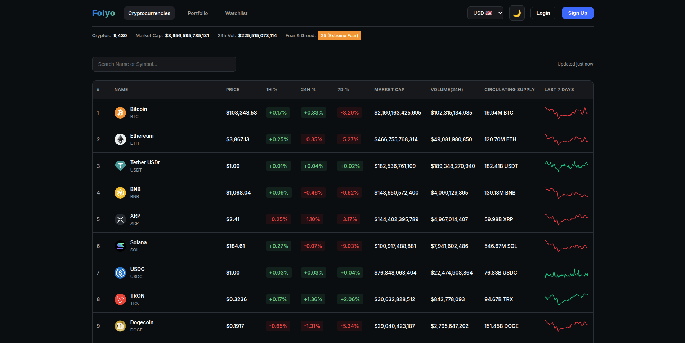

# Folyo - Cryptocurrency Market Tracker

desenvolvido com HTML, CSS, JavaScript e PHP. Exibe preços, market cap, volume e outras métricas de criptomoedas em tempo real.



## ✨ Funcionalidades

### 🎯 Principais
- **Top 100 Criptomoedas** por market cap (expansível com paginação)
- **Tabela Completa** com 10 colunas de dados detalhados
- **Stats Globais** no header (Total Market Cap, Volume 24h, Dominance)
- **Fear & Greed Index** do mercado cripto
- **93+ Moedas Suportadas** (USD, EUR, BRL, GBP, JPY, etc.)
- **Auto-Refresh** a cada 60 segundos
- **Tema Claro/Escuro** com persistência

### 🔍 Interativas
- **Busca em Tempo Real** por nome ou símbolo
- **Ordenação Clicável** em todas as colunas
- **Paginação Completa** (100 itens por página)
- **Sparkline Charts** (mini gráficos de 7 dias)
- **Seletor de Moedas** persistente (localStorage)

### 📱 Responsividade
- **Desktop**: Tabela completa (10 colunas)
- **Tablet**: Tabela reduzida (7 colunas)
- **Mobile**: Layout de cards otimizado

## 🛠️ Tecnologias

### Frontend
- HTML5
- CSS3 (com variáveis CSS para temas)
- JavaScript ES6+ (vanilla, sem frameworks)
- Google Fonts (Inter)

### Backend
- PHP 7+
- Cryptocurrency Data API (v1/v2/v3)

### Armazenamento
- LocalStorage (tema, moeda, última atualização)

## 📁 Estrutura do Projeto

```
folyo/
├── index.html                 # Página principal
├── .env                      # API key (não commitar!)
├── .gitignore
├── api/
│   └── proxy.php            # Proxy PHP para API de criptomoedas
├── css/
│   ├── style.css            # Estilos principais
│   ├── themes.css           # Variáveis de tema
│   └── responsive.css       # Media queries
├── js/
│   ├── config.js            # Configurações e constantes
│   ├── api.js               # Comunicação com API
│   ├── utils.js             # Funções auxiliares
│   ├── ui.js                # Renderização da UI
│   ├── currency.js          # Gerenciador de moedas
│   ├── theme.js             # Gerenciador de temas
│   └── app.js               # Inicialização e orquestração
└── assets/
    └── logo.svg             # Logo do projeto
```

## 🔒 Segurança

- ✅ API key armazenada server-side (PHP)
- ✅ `.env` no `.gitignore`
- ✅ Proxy PHP evita exposição da key
- ✅ Headers CORS configurados

## 📈 Performance

- **Auto-refresh otimizado**: Para quando aba está inativa (battery saving)
- **Debounce na busca**: 300ms para evitar requests excessivos
- **Lazy loading**: Logos carregadas sob demanda
- **Cache**: Dados mantidos durante navegação (state preservation)

## 🐛 Troubleshooting

### API não funciona
1. Verifique se o `.env` existe e tem a key correta
2. Teste o proxy diretamente: `http://localhost/folyo/api/proxy.php?endpoint=global-metrics`
3. Confira logs do PHP: `tail -f /var/log/apache2/error.log`

### CORS Error
- O proxy PHP deve resolver isso automaticamente
- Verifique se `proxy.php` tem permissões de execução

### Dados não aparecem
1. Abra o Console do navegador (F12)
2. Verifique erros JavaScript
3. Teste o proxy diretamente no navegador ou com `curl`:
```bash
curl http://localhost/folyo/api/proxy.php?endpoint=global-metrics
```

## 🤝 Contribuindo

Contribuições são bem-vindas! Por favor:

1. Faça um Fork do projeto
2. Crie uma branch: `git checkout -b feature/nova-funcionalidade`
3. Commit suas mudanças: `git commit -m 'Adiciona nova funcionalidade'`
4. Push para a branch: `git push origin feature/nova-funcionalidade`
5. Abra um Pull Request

**Desenvolvido com ❤️ usando HTML, CSS, JavaScript e PHP**
